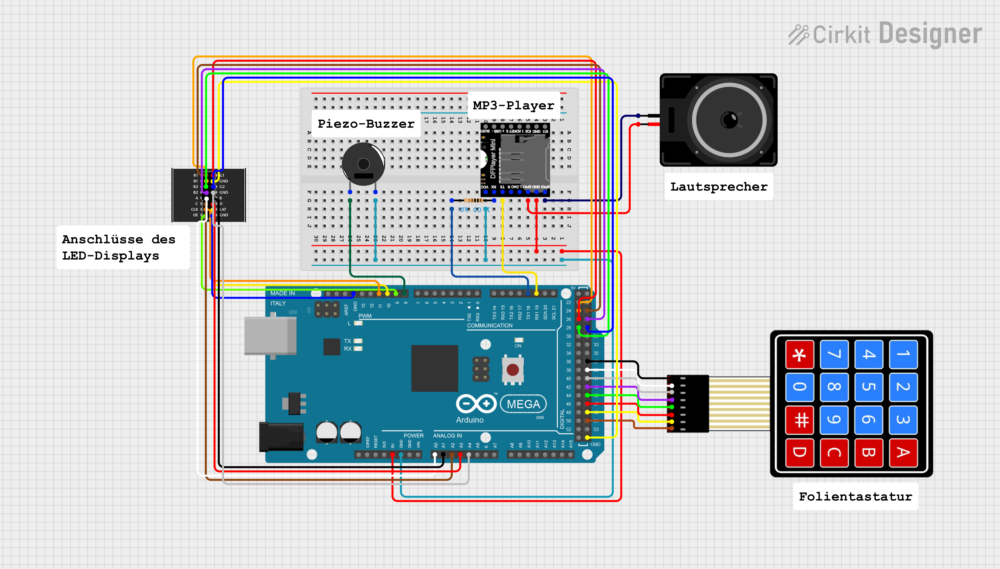

# Tetris
A Tetris game implemented on a Joy IT ATMega2560R3 with 64x64 pixel LED matrix display.

# Hardware Requirements
- Arduino Mega 2560 or similar microcontroller
- 64x64 LED matrix display
- 4x4 matrix keypad
- mini MP3 Player
- 256 MB microSD
- piezo buzzer
- 3 W speaker
- power supply for display (5 V, 4 A)
- breadboard and jumper wires

# Wiring

- Display wiring: [Waveshare RGB Matrix 64x64](https://www.waveshare.com/wiki/RGB-Matrix-P3-64x64)
- MP3 Player wiring: [DFRobot Wiki MP3 Player mini](https://wiki.dfrobot.com/DFPlayer_Mini_SKU_DFR0299)

# Installation
1. Clone repository:
`git clone https://github.com/Antimon80/Tetris.git`
2. Open project in the Arduino IDE.
3. Ensure the required libraries are installed:
    - RGBMatrixPanel
    - DFRobotDFPlayerMini
    - Keypad
    - avr/pgmspace (included in AVR boards package)
4. Upload the code to your Arduino.

# Controls
- **A** Start game
- **B** Pause
- **C** Reset game after game over
- **#** Volume up
- **\*** Volume down
- **6** Move Tetromino to the left
- **4** Move Tetromino to the right
- **5** Rotate Tetromino
- **2** Accelerate Tetromino's descent

# Scoring and Leveling Up
- Clearing 1 line: 2 points * level
- Clearing 2 lines: 6 points * level
- Clearing 3 lines: 10 points * level
- Clearing 4 lines: 20 points * level

The game will advance to the next level after clearing 10 lines. Each level increases the speed of the falling Tetrominos, making them harder to control.

# Acknowledgments
- Inspired by the classic Tetris game.
- Thanks to the Ardafruit and DFRobot team for their libraries and resources.
